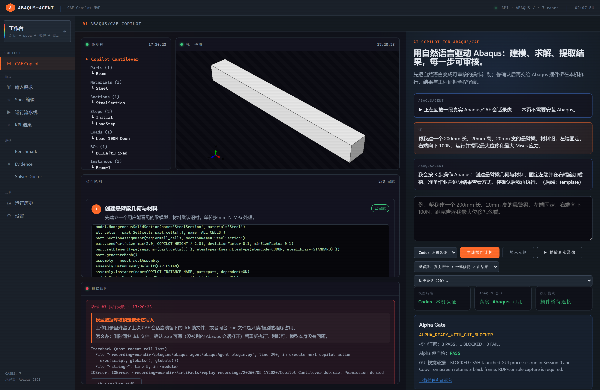

# Abaqus Agent

**English** | [简体中文](README.zh-CN.md)

[](https://github.com/Tomsabay/abaqus_agent/actions/workflows/ci.yml)
[](LICENSE)
[](LICENSING.md)
[](pyproject.toml)

**Local Simulation QA & Regression Framework for Abaqus FEA.**

Turn Abaqus runs into reproducible experiment capsules:

```text
.inp / spec -> syntaxcheck -> solver -> ODB KPI -> physics contracts -> diff report
```

Abaqus Agent runs in your own Abaqus-licensed environment. The core is deterministic and auditable; LLMs, MCP clients, Codex, Claude Code, or the web UI are optional frontends.

## See It In 60 Seconds — CAE Copilot Workspace

A Cursor-style workspace for Abaqus/CAE: describe the model in plain language — the
Copilot's scenario library is cantilever, simply-supported three-point bend,
plate-with-hole tension and cantilever modal analysis, which is its list and not the
engine's; see [the model layer](#the-model-layer--generic-dispatch-and-a-truth-layer-under-it)
for what the spec dialect underneath can build —
review the generated action plan, execute it inside CAE through the plugin bridge, and
watch the model tree, viewport snapshots, and errors stream back live. When an action
fails, a plain-language diagnosis explains what happened (15 CAE failure patterns) and one
click asks the Copilot for a repaired plan; failed solves additionally get an automatic
Solver Doctor pass over the job's .msg/.sta/.dat logs (30+ known patterns). Every scenario
is theory-checked on a real solver with the coarse demo meshes: cantilever tip vs PL^3/3EI,
simply-supported midspan vs PL^3/48EI (both ~1.3x, the same systematic mesh softness),
plate-with-hole Kt 2.7 vs Howland's 3.1, first modal frequency within 14% of the
Euler-Bernoulli solution, plus the solver-failure diagnosis chain.

Those four are the first five of 41 gates. `python
scripts/run_all_real_checks.py` runs every one of them and prints a single
verdict; it needs Abaqus for the solver gates and a browser for the UI ones, and
takes upwards of an hour.



**No Abaqus needed to watch the demo.** The repo ships a recorded real Abaqus 2021 session
(`evidence/copilot_replay/replay.json` — real failure, real fix, real KPIs):

```bash
pip install -e ".[dev]"
python server.py
# open http://127.0.0.1:8000/copilot -> ▶ 播放真实录像
```

The replay shows the full loop: plan cards typing out, action chips flipping, the model tree
growing, real viewport PNGs, a genuine stale-lock failure with its diagnosis card, the
one-click fix, and the final KPIs (max displacement 0.1286 mm, max Mises 9.58 MPa).
On a machine with Abaqus, `python scripts/record_copilot_replay.py` re-records it live.

[`http://127.0.0.1:8000`](http://127.0.0.1:8000) opens the **workbench** — the
product itself: describe a model in natural language, review the generated
`spec.yaml` diff, accept it, watch the stages run, and read the KPIs and the 3D
preview. The Copilot replay page above lives at `/copilot`.

## Why This Exists

Most AI simulation demos focus on generating a model or script. Real Abaqus teams usually have a harder problem:

- Did this run use the right input deck, solver settings, Abaqus version, and environment?
- Are the ODB KPIs within expected physical bounds?
- What changed between this run and the previous baseline?
- Why did the solver fail?
- Can this result be turned into a repeatable report for a team or customer?

Abaqus Agent is moving toward the simulation equivalent of `pytest` / CI / diff / diagnostics for Abaqus workflows.

## v0.2 Direction

The current codebase already has the original Abaqus automation pipeline. The v0.2 direction adds a Simulation DevOps kernel:

| Capability | Status | Purpose |
|---|---:|---|
| `custom_inp` first | Implemented | Bring existing customer `.inp` files instead of forcing NL/spec generation. |
| Experiment Capsule | Implemented | Store inputs, artifacts, hashes, environment, and provenance in `capsule.json`. |
| ODB Lens / KPI DSL | Implemented MVP | Reusable KPI extraction recipes and KPI Markdown reports for `.odb` outputs. |
| Physics Contracts | Implemented MVP | Check ranges, directions, relative error, and ordered KPIs. |
| Simulation Diff | Implemented MVP | Compare run/capsule inputs, KPIs, contracts, artifacts, and provenance with structured change summaries. |
| Solver Doctor | Implemented MVP | Diagnose `.sta/.msg/.log/.dat` failures from 30+ known patterns. |
| MCP QA Tools | Implemented MVP | Expose capsule, contract, diff, and doctor kernels to MCP clients. |
| Case Memory | Implemented MVP | Search and rank local run/capsule history by metadata, facet filters, KPIs, contract names/results, diagnosis IDs, artifact names, similarity signals, count-based sort controls, and minimum score. |
| Report Export | Implemented MVP | Produce Markdown, standalone/printable HTML, optional PDF, and zipped run report bundles from capsules, KPIs, contracts, evidence checklists, and visuals across CLI/API/MCP/UI. |
| Environment Preflight | Implemented MVP | Record OS, Python, Abaqus command, release-check, expected-release match, workdir writability, license markers, and runner config evidence across CLI/API/MCP/UI before real validation. |

See [docs/ROADMAP.md](docs/ROADMAP.md) for where this is going, and for the rule
that decides when something moves from "the code path exists" to "supported".

## The Model Layer — Generic Dispatch, And A Truth Layer Under It

The scenario list above is the Copilot's, not the engine's. Underneath it is a
spec dialect that describes `parts`, `assembly`, `interactions`, `steps` and
`conditions`, and it does not work from a closed list of supported features.
A spec names the Abaqus method it wants and the arguments to pass:

```yaml
parts:
  - name: Flange
    features:
      - op: sketch
        id: profile
        entities: [ ... ]
      - call: BaseSolidRevolve
        sketch: {sketch: profile}
        angle: 360.0
        flipRevolveDirection: "OFF"
    expect: {volume: 26389.378290154, cells: 1, faces: 4}
```

`getattr(part, "BaseSolidRevolve")(**kwargs)` does the rest. Abaqus exposes 292
callables on `Part` and 71 on `ConstrainedSketch`, and the lists grow every
release; enumerating them in a schema would mean the dialect could only ever
build the shapes somebody had already written a branch for.

That is only defensible with something underneath it, because what generic
dispatch gives up is a schema that knows what each call was *supposed* to
produce. So it is replaced by `expect:` blocks checked against the built model:

| Layer | What it checks |
|---|---|
| Geometry | volume, cells, faces, cylindrical faces, where a feature landed |
| Mesh | element count, shape quality criteria, and how many elements a criterion did not apply to |
| Assembly | instance count, where each instance ended up, that created parts reach the analysis |
| Contact | the measured gap between the two surfaces a pair was built from |

The failures these exist for are not hypothetical, and each one is a measured
refusal rather than a guess:

- `elemShape=HEX` on a body with no hexes in it is **accepted** by Abaqus. It
  meshes nothing, raises nothing, and the job completes.
- A cut whose holes miss the solid removes nothing, returns 0, and leaves the
  volume byte-identical.
- An assembly boolean creates a part nothing meshes; the `.inp` carries an empty
  `*Part` with a live `*Instance` and not one `*Element`.

**[docs/SILENT_FAILURES.md](docs/SILENT_FAILURES.md) is the full catalogue** —
seven measured ways an Abaqus job finishes and hands back a wrong answer, with
the numbers, including a tie constraint that left 85 nodes unconstrained while
the job converged and every equilibrium check still passed. Written to be
useful on your own model whether or not you ever run this tool.

Five worked cases ship in this dialect — `bearing_block`, `two_plate_tie`,
`two_plate_contact`, `block_friction_slide`, `plate_hole_v2` — and the gate
scripts that prove the layer are in `scripts/run_generic_*_check.py`, with
their summarised output committed under
[`evidence/gates/`](evidence/gates/). The dialect itself is
[`schema/spec_schema.json`](schema/spec_schema.json), whose descriptions carry
the measurement behind each rule; the shortest complete example is
[`cases/two_plate_tie/spec.yaml`](cases/two_plate_tie/spec.yaml).

## Installation

Install from source:

```bash
git clone https://github.com/Tomsabay/abaqus_agent.git
cd abaqus_agent
pip install -e ".[dev,mcp]"
```

Optional extras:

```bash
pip install -e ".[llm]"  # Anthropic / OpenAI planners
pip install -e ".[all]"  # dev + mcp + llm
```

## Quick Start

### Solve a case

```bash
pip install -e ".[dev]"

python agent/orchestrator.py cases/cantilever/spec.yaml \
  cases/cantilever/expected.json \
  cases/cantilever/runner.json
```

The Abaqus release is probed from the installed solver, never taken from the
spec. If Abaqus is not on `PATH`, point at it:

```bash
# Windows
set ABAQUS_AGENT_ABAQUS_CMD=C:\SIMULIA\Commands\abaqus.bat
# Linux
export ABAQUS_AGENT_ABAQUS_CMD=/opt/simulia/Commands/abaqus
```

### You need Abaqus

This drives Abaqus. Without it there is nothing to solve, and the run is
refused with that one sentence rather than approximated.

A CalculiX fallback shipped in August 2026 and was removed two weeks later. It
worked — it matched the frozen cantilever baseline to seven significant figures
— but keeping it honest meant maintaining a capability matrix listing, feature
by feature, what the second solver could be trusted with, and refusing
everything else before the solve started. That is a permanent tax paid for
reach we do not want: someone with no Abaqus is not a user of an Abaqus
workbench. There is no walkthrough mode either, for the same reason a demo that
narrates seven stages and finishes green is worse than a refusal.

The parts that outlived it are the parts that were never about CalculiX: a
number is never produced without a solver behind it, a KPI whose definition
differs from Abaqus is tagged and excluded from pass/fail rather than quietly
graded, and a refusal always names the spec field it is refusing.

### Run the test suite

```bash
pytest -q
```

The suite is hermetic: it hides Abaqus, so no test can reach a real solver.

Check whether the current machine is ready for real Abaqus validation:

```bash
abaqus-agent validate env --json
abaqus-agent validate env --expected-release 2026 --strict --out validation-preflight.md
abaqus-agent validate env --workdir runs --runner-json '{"cpus":4,"mp_mode":"threads","timeout_seconds":900}' --json
abaqus-agent validate record --environment "Windows 11" --abaqus "Abaqus 2021" --workflow "cantilever" --result PASS --evidence "status=COMPLETED"
```

Export an offline report from a run directory, `capsule.json`, or `result.json`:

```bash
abaqus-agent report export runs/my_run --template client_summary --out report.html
abaqus-agent report export runs/my_run --template client_summary --out report.pdf
abaqus-agent report export runs/my_run --template engineering_delivery --out delivery.html
abaqus-agent report export runs/my_run --out report.zip
```

PDF export is optional and renders the standalone HTML report through Playwright:

```bash
pip install "abaqus-agent[pdf]"
playwright install chromium
```

The web UI's Report panel can also load the same offline source path and render the report without starting a new analysis run.

Validate public benchmark specs without Abaqus:

```bash
python run_benchmark.py --dry-run
```

Run one full Abaqus case on a machine with Abaqus installed:

```bash
python agent/orchestrator.py cases/cantilever/spec.yaml \
  cases/cantilever/expected.json \
  cases/cantilever/runner.json
```

Use an existing `.inp` as a first-class input. The deck already carries its own
parts, steps, boundary conditions and loads, so the spec describes none of them —
and `parts`/`assembly`/`steps`/`conditions` are refused here rather than ignored,
because a spec that states a load the deck does not contain would describe a
model that never ran:

```yaml
meta:
  abaqus_release: "2021"
  model_name: "CustomerModel"
deck:
  file: model.inp        # relative to this spec file
material:
  name: Placeholder
  E: 210000
  nu: 0.3
outputs:
  kpis:
    - name: U_tip
      type: field_min
      component: U2
      location: whole_model
```

Create an experiment capsule from an `.inp`:

```bash
abaqus-agent capsule init --from-inp model.inp --out runs/model_capsule
```

```python
from capsule.store import init_from_inp

capsule = init_from_inp("model.inp", "runs/model_capsule")
print(capsule["run_id"])
```

Evaluate physics contracts:

```python
from contracts import evaluate_contracts

result = evaluate_contracts(
    [
        {"name": "deflects_down", "type": "direction", "kpi": "U_tip", "direction": "negative"},
        {"name": "stress_margin", "type": "range", "kpi": "MISES_MAX", "max": 250.0},
    ],
    {"U_tip": -0.002, "MISES_MAX": 210.0},
)
```

Diagnose solver logs:

```bash
abaqus-agent doctor Job-1.msg Job-1.sta
```

```python
from doctor import diagnose_logs

diagnosis = diagnose_logs(paths=["Job-1.msg", "Job-1.sta"])
```

Compare KPI results:

```bash
abaqus-agent diff runs/baseline runs/candidate --out diff.md
abaqus-agent diff runs/baseline runs/candidate --tolerances-json '{"MISES": 0.20}' --out diff.md
```

Search local case memory:

```bash
abaqus-agent memory search runs/ --query too_many_attempts --json
abaqus-agent memory search runs/ --similar-to runs/candidate --kpi U_tip --out memory.md
```

```python
from simdiff import diff_runs

diff = diff_runs("runs/baseline", "runs/candidate")
```

Normalize an ODB Lens KPI recipe and render a KPI report:

```yaml
kpis:
  - name: max_mises
    source: odb
    field: S
    invariant: MISES
    region: set:CRITICAL_ZONE
    reducer: max
```

```bash
abaqus-agent lens normalize kpis.yaml --out _kpi_spec.json
abaqus-agent lens report result.json --recipe kpis.yaml --out kpi_report.md
```

## Architecture

```text
Codex / Claude Code / ChatGPT / Web UI / CLI
        |
        v
Intent layer (optional LLM)
        |
        v
Simulation DevOps kernel
  - Experiment Capsule
  - Physics Contracts
  - ODB Lens
  - Solver Doctor
  - Simulation Diff
        |
        v
Abaqus adapter / local BYOL runner
  - noGUI
  - syntaxcheck
  - submit
  - monitor
  - ODB extraction
        |
        v
Artifacts: .inp, .cae, .odb, .sta, .msg, .log, reports
```

The older NL-to-spec planner remains available, but it is no longer the product center.

## Project Structure

```text
agent/              End-to-end orchestration and optional LLM planner
capsule/            Experiment capsule manifest, hashing, and store helpers
contracts/          Physics contract evaluation
doctor/             Solver log diagnostics and pattern library
odb_lens/           Declarative KPI recipes and Markdown KPI reports
simdiff/            KPI diff and Markdown rendering
runner/             Abaqus build, syntaxcheck, submit, monitor
post/               ODB KPI extraction
tools/              Errors, schema validation, static guard, Abaqus command resolver
mcp_server.py       MCP server for agent integration
mcp_bridge.py       HTTP/SSE bridge for browser clients
server.py           FastAPI server
cases/              Public benchmark specs
features/           Optional analysis modules: coupling, adaptivity, parametric,
                    extended geometry, auto-repair
```

## Benchmark Status

Public specs currently cover:

| Case | Type | Solver | Key KPIs |
|---|---|---|---|
| `cantilever` | 3D static beam | Standard | `U_tip`, `MISES_MAX` |
| `plate_hole` | 2D plane-stress plate | Standard | `MISES_HOLE_EDGE`, `U_X_MAX`, `SCF` |
| `modal` | Fixed beam modal | Standard / Lanczos | `freq_1`, `freq_2`, `freq_3` |
| `explicit_impact` | Dynamic compression | Explicit | `RF_Z_MAX`, `U_Z_MIN` |
| `blast_plate` | Protective blast plate demo | Explicit | `U_MAX_DEFLECTION`, `PEEQ_MAX`, `ALLPD_MAX` |

And in the v2 dialect, where the model is built from dispatched Abaqus calls
rather than from a geometry type:

| Case | What it is | Interactions | Key KPIs |
|---|---|---|---|
| `two_plate_tie` | one part, two instances, tied | tie | `U_TIP`, `MISES_MAX` |
| `two_plate_contact` | the same pair, in contact instead | contact | `U_TIP`, `MISES_MAX` |
| `block_friction_slide` | two parts, two static steps: press, then push | contact + friction | `FRICTION_FORCE`, `NORMAL_FORCE` |
| `plate_hole_v2` | plate with a hole, built from sketch entities | — | `HOOP_MAX`, `HOOP_S22`, `FAR_FIELD` |
| `bearing_block` | three parts, three steps, bolt preload, tie and contact together | tie + contact | `WEIGHT_TOTAL`, `CLAMP_REACTION`, `FRICTION_FORCE`, `BUSHING_DROP`, `CAP_MISES_MAX` |

Notes:

- `python run_benchmark.py --dry-run` validates specs without Abaqus.
- `abaqus-agent validate env` and the Environment panel record OS, Python, Abaqus command resolution, `abaqus information=release`, expected-release match, workdir writability, license markers, and runner config evidence before real validation.
- `abaqus-agent validate record` appends a normalized evidence row to `docs/VALIDATION_MATRIX.md` after real Windows/Linux/Abaqus runs, creating the file on first use — your matrix records your environments, not ours.
- `abaqus-agent report export`, `/api/report/export`, MCP bridge, and the Report panel produce Markdown, standalone HTML, optional PDF, or zipped report bundles from offline run evidence.
- Full regression requires a local Abaqus installation and license.
- The evidence behind every "supported" claim is a check harness you can run yourself: `scripts/run_*_check.py`.
- Current local validation has been done on Abaqus 2021 / Windows.
- An external contributor reported Abaqus 2026 compatibility; the original report is no longer distributed with this repository, so it is not part of the current gate evidence.

## Safety And Deployment

All generated or processed workflows are intended to run locally in the user's own Abaqus-licensed environment.

The recommended commercial deployment model is BYOL:

- customer-local runner
- customer-owned Abaqus license
- local artifacts and ODBs
- optional consulting, report templates, private recipes, and team runner

Do not run third-party Abaqus workloads as a hosted SaaS without explicit legal review of the relevant Dassault Systemes license terms.

## Roadmap

- [x] 7-stage Abaqus pipeline: validate, build, syntaxcheck, submit, monitor, extract, compare
- [x] Windows `.bat` command resolver for Abaqus subprocess calls
- [x] MCP server and HTTP bridge
- [x] FastAPI/SSE web API
- [x] `custom_inp` no-CAE build path
- [x] v0.2 capsule / contract / diff / doctor kernel MVP
- [x] Capsule-backed run output from the orchestrator
- [x] Solver Doctor / contract check / KPI diff CLI
- [x] ODB Lens YAML KPI recipe normalization and KPI Markdown reports
- [x] Simulation Diff CLI/API/UI with real Windows Abaqus validation
- [x] Simulation Diff structured change summary across Markdown/API/UI
- [x] Simulation Diff per-KPI tolerance overrides across CLI/API/MCP/UI
- [x] Simulation Diff Markdown download endpoint and UI action
- [x] Simulation Diff structured artifact evidence rows with hash/size/reason across Markdown/API/UI
- [x] MCP tools for capsule init, contract check, Solver Doctor, and Simulation Diff
- [x] ODB Lens direct Abaqus extractor coverage for frame, region, component, invariant, and reducer fields
- [x] Markdown report templates
- [x] Engineering delivery report template for downstream HTML/PDF handoff
- [x] Evidence checklist in delivery reports for capsule/result/KPI/regression/contract/artifact/doctor handoff
- [x] Delivery Manifest section for engineering handoff bundle/readiness/artifact payload summary
- [x] Validation matrix for Abaqus versions and operating systems
- [x] Case Memory deterministic local capsule search
- [x] Case Memory CLI/API/MCP/UI workflow with real capsule-history validation
- [x] Case Memory artifact, sort order, and minimum score controls across CLI/API/MCP/UI
- [x] Case Memory contract filters and KPI/artifact count sort controls across CLI/API/MCP/UI
- [x] Case Memory free-text match mode controls (`any` / `all`) across CLI/API/MCP/UI
- [x] Case Memory result facets for status/geometry/solver/material/contract-result summaries
- [x] Case Memory facet filters for geometry, solver, and material across CLI/API/MCP/UI
- [x] Markdown report copy/download actions in the web UI
- [x] Standalone HTML report export endpoint and web UI download action
- [x] Browser preview/print mode for downstream PDF handoff
- [x] Optional PDF report export across CLI/API/MCP bridge/UI via Playwright
- [x] Report bundle zip endpoint and web UI download action
- [x] Environment preflight CLI/API/MCP/UI workflow for Linux/Windows/Abaqus version validation readiness
- [x] Expected Abaqus release matching in Environment Preflight across CLI/API/MCP/UI
- [x] Workdir, license marker, and runner config readiness checks in Environment Preflight
- [x] Validation matrix evidence recorder CLI for real-run evidence rows
- [x] Offline report export CLI/API/MCP/UI workflow for run directories, capsules, and result JSON files

## Acknowledgments

- **[@ganansuan647](https://github.com/ganansuan647) (GLY2024)** — first external contributor. Reported Abaqus 2026 compatibility on a licence this project does not have, and contributed Windows command-path fixes.

## License

**AGPL-3.0-or-later** — see [LICENSE](LICENSE).

Most people never need anything else: running it, modifying it, and using it
commercially inside your own organisation are all free under the AGPL. The
obligation it adds is narrow — if you offer a modified version to others over
a network, those users must be able to get your modified source.

If that does not fit (closed-source embedding, proprietary redistribution, or
a hosted service you cannot open), a **commercial licence** is available and
priced openly in [LICENSING.md](LICENSING.md) — no "contact us for a quote".

Two deliberate carve-outs, so integrating with the tool never drags AGPL in:

- `schema/`, `cases/` and `examples/` stay under **Apache-2.0**
  ([LICENSES/Apache-2.0.txt](LICENSES/Apache-2.0.txt)) — they are the
  integration surface, and anyone should be able to implement against them.
- Releases published between 2026-03-06 and 2026-06-16 were Apache-2.0. That
  grant is irrevocable and forks from that period may continue under it.

Full detail in [NOTICE](NOTICE). Contributions stay inbound-Apache-2.0 — no
CLA, no copyright assignment (see [CONTRIBUTING.md](CONTRIBUTING.md)).
